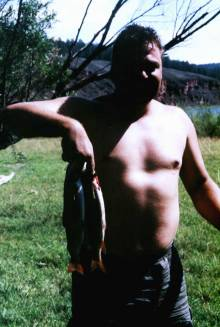
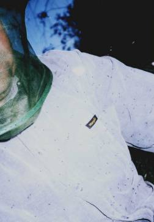
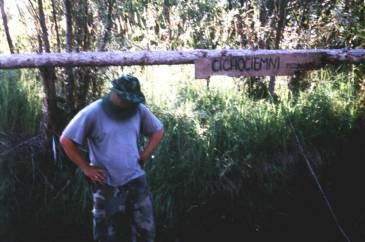
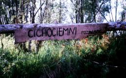
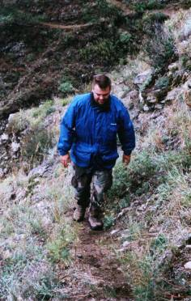
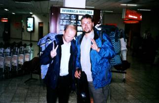
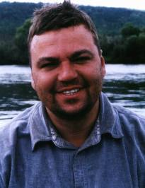

# Syberia 2002

## Luty 2002\. Godzina 18.45\. Parking przed Kinepolis. Poznań

Paweł, Krzysiu i ja. Idziemy na film. Rozmawiamy o planach wakacyjnych. Krzysiu:\

- znajomy miał fajny pomysł. Zrobił kurs barką na jednej z syberyjskich rzek. Tam barki normalnie w górę i w dół rzeki kursują. Może byśmy powtórzyli ten wyczyn?

Paweł: - Tylko ktoś już to wymyślił.

Ja: - Ale z Syberią pomysł jest dobry.

Po kilku sekundach przychodzi olśnienie: nikt, o ile nam wiadomo, nie zbudował tratwy.

W nocy nie mogę spać. Pomysł budowy tratwy i popłynięcia przez tajgę jest tak niedorzeczny i tak pociągający jednocześnie, że nie daje zasnąć. Płynę więc w myślach przez zielone lasy a z krystaliczno czystej wody rzeki wyskakują ryby i mówią rybim głosem: weź nas na haczyk. Dookoła góry, niedźwiedzie i łosie. Nad ranem wpadam w płytką drzemkę.

## Marzec 2002.

Poszukuję informacji o Syberii, wyprawach Polaków, spływach. Okazuje się jednak że spływy cieszą się dużą popularnością. Można wynająć przewodnika i za kilkaset dolarów odbyć dobrze zaplanowaną wyprawę. Godzina 8.00 - pobudka, godzina 9.00 – wypłynięcie, godzina 11.00 – zwiedzanie dopływu rzeki, godzina 20.00 – ognisko tańce ludowe. Obrzydliwe jak dla mnie.

Są jednak też tacy, co zbudowali tratwę. Zdjęcia na stronie <http://afryka.underweb.net/syberia/> pomagają nam uwierzyć w realność pomysłu. Zrobimy to jednak sami – bez przewodników i w małej 3-4 osobowej ekipie. Później okaże się, że pojedziemy we dwóch – Paweł i ja. I w realność pomysłu nie będziemy wierzyć nawet na lotnisku w Irkucku.

## Marzec 2002\. Godzina 8.30\. Rakoniewice.

Jadę samochodem z Poznania do Zielonej Góry na wykład dla pracowników urzędów skarbowych. Przy drodze widzę ogromne składowisko opon i dętek. Największe są dętki od radzieckich Kirowców. Właściciel składowiska oferuje mi je za 50 zł. za sztukę.

W drodze powrotnej, wieczorem, kupuję jedną. Ciężkie bydlę waży z 20 kilogramów. Mróz. Powietrze spuszczam pół godziny. Mimo to ledwie mieści się w samochodzie. Chcę sprawdzić czy na dętkach z Kirowca utrzyma się tratwa. Do domu wchodzę w garniturze z wielką dętką przewieszoną przez ramię. Zajmuje całą wannę. Wygląda pięknie. Z napisem _made in USSR_.

## Kwiecień 2002\. Śmingus dyngus. Południe. Kiszkowo koło Poznania. Jezioro.

Z Jasiem (moim synkiem) i Pawłem zajeżdżamy nad brzeg jeziora. Słońce. Zimna ziemia. Będziemy robić próby wypornościowe. Pompowanie kupionej na próbę opony od Kirowca trwa ponad 30 minut. Cali spoceni zmieniamy się przy pompce. Kto nie pompuje psika się z Jasiem wodą z pistoletów na wodę. Wędka zarzucona tak na wszelki wypadek. I tak nic nie złowię.

Wodowanie napompowanej dętki. Rezultaty zachwycające – utrzymuje mnie, utrzymuje Pawła. Guma gruba, mocna. Utrzyma tratwę.

## Koniec kwietnia 2002\. Most nad Wartą pomiędzy Biedruskiem a Murowaną Gośliną.

Zdziwiony wędkarz obserwuje jak rzucam do wody patyczki i truchtam gdy one płyną rzeką. Przechodzę dalej na zakręt rzeki. Wędkarz wyciąga z torby lornetkę i obserwuje mnie dyskretnie. Rzucam kolejny patyczek i idę wolnym krokiem. Wędkarz wstaje. Według mnie szybkość przepływu rzeki wynosi od 4 do 8 kilometrów w zależności od jej szerokości i głębokości. Wiem o tym z książki "Wędkarz i rzeka" Wacława Strzeleckiego, którą ostatnio studiuję. Musimy nauczyć się zdobywać pożywienie.

## Maj – lipiec 2002

Kolega z kancelarii: - Na Syberię pojechali w zeszłym roku Polacy. Łapali stopa. Wyskoczyli Rosjanie z młotkami i ich zmasakrowali.

Teściowa: - Rychu zwariowałeś. Czy ty masz pieprz w dupie? Masz przeczytaj sobie artykuł o tym jak Polacy zaginęli.

Kolega z pracy: - Jak zobaczę zdjęcia to masz u mnie skrzynkę piwa.

Mama: - Nie chcę w ogóle z tobą o tym rozmawiać.

Tata: - Ty nie masz w ogóle wyobraźni. Ja już niejedną tratwę w życiu zbudowałem. Na trzeci dzień drewno nasiąka i nie można płynąć.

Mama: - Syn koleżanki nie pojechał na Syberię i ocalił życie. Jego kolegów przywiązali do drzew i torturowali.

Kolega z pracy: - Jeden obudził się w rowie a drugiego nigdy nie odnaleziono.

Koleżanka z pracy: - Rysiu czy ubezpieczyłeś się na życie?

Kolega z pracy: - Znowu spadł samolot.

Gazeta Wyborcza: - "Płk Hermaszewski tonie w nurtach Angary podczas wyprawy myśliwskiej"

Żona: - Jedź kochanie ale obiecaj że porozmawiasz z naszym agentem ubezpieczeniowym.

Mama: - Już nic nie mówię.

Teściowa: - Rychu mam dla ciebie bardzo ciekawy artykuł o norweskich fiordach.

Rodzice: - Będziemy się modlili.

Żona: - Będę się modliła.

Teściowa: - Piszą że straszne powodzie na Syberii. A w Norwegii piękna pogoda.

## 15 sierpnia. Okęcie. godz. 11.00

Stoimy wśród tłumów turystów wylatujących do Turcji, na Seszele. Dwa plecaki po 15 kg i gitara.

Dureń ze mnie. Do podręcznego bagażu wziąłem szwajcarski scyzoryk. Konfiskują mi go natychmiast. Zostajemy z jednym myśliwskim nożem. Dobre i to.

Po dwóch godzinach jesteśmy w Moskwie. Czekamy 6 godzin na lot do Irkucka. Zamawiam wodę mineralną i piwo. Barmanka prosi o 32 złote. Grzecznie się wycofuję, choć piwo już nalane do szklanki. Barmanka nie okazuje zdziwienia.

Przy kontroli bagażu zostaję zatrzymany przez pracowników lotniska. Okazuje się, że myśliwski nóż który mam w plecaku to według rosyjskiego prawa broń na którą trzeba mieć pozwolenie. Prowadzą mnie na milicję. W połowie drogi mówię do prowadzącej mnie pani że chce mnie puścić do tajgi bez noża a tam są niedźwiedzie a ja mam czwórkę dzieci. Mówię, że kupię od niej dokumenty uprawniające do posiadania noża. Pani zatrzymuje się: "Dobrze, dogadamy się." Chwilę później plecak jest już po odprawie a ja podaję pani paszport w którym jest 10 dolarów. Ona bierze paszport i bilet. Udaje że mi coś tłumaczy i dyskretnie bierze łapówkę. Niech się udławi tymi dolarami.

## 16 sierpnia. Irkuck – Kaciug.

Po 5 godzinach lotu o 7 rano czasu lokalnego (w Polsce jest północ) – lądujemy we mgle na lotnisku w Irkucku. Przy pobieraniu bagażu poznajemy polskiego konsula, który wraca właśnie z Moskwy.

Wychodzimy przed budynek. Szaro, zimno, mgła. Mnóstwo podejrzanych facetów w skórzanych i dżinsowych kurtkach. Niedogoleni. Oferują taksówki, hotel, nocleg. My jednak autobusem 42 jedziemy do centrum. Za oknem brudne, brzydkie, zniszczone miasto. Ulica Lenina, Marksa, Dzierżyńskiego. Ludzie jadą do pracy.

Na ławce w parku studiujemy kupioną na lotnisku mapę.

Do tej pory pomysł spływu własnoręcznie zrobioną tratwą wydawał się nam niedorzeczny. I nadal nie wyobrażamy sobie że to się uda. Dlatego do tej pory nie myśleliśmy w ogóle o tym, jaką rzekę należy wybrać. Jenisej – brzmi dziko i dumnie. Ale daleko. Czytamy nazwy rzek – niewiele nam mówią. Mapa niedokładna – nie pokazuje ukształtowania terenu. Nie możemy sobie pozwolić na bystrą rzekę. Nasza wyobrażona tratwa to nie ponton, który można przenieść. Badając strugę Leny dostrzegamy, iż na wysokości Kaciuga (270 km od Irkucka) zaznaczono na mapie kotwiczkę. Tam zaczyna się pewnie strefa żeglowna.

Paweł zostaje w parku a ja idę na miasto zasięgnąć języka. Przed hotelem Angara stoi łysy taksówkarz. Podchodzę do niego i nawiązuję rozmowę.

- Niestety to co chcecie zrobić jest zabronione.

- Jak to zabronione?

- Spławianie drzewa jest zabronione, nie możecie tego robić.

Okazuje się że tratwa to po rosyjsku "płot" a nie "liesopław" jak podawał słownik. Po uzgodnieniu terminologii przechodzimy do konkretów.

- Tak na wysokości Kaciuga Lena jest już spokojna. Możecie płynąć tratwą. To są naprawdę dzikie miejsca – niedźwiedzie, łosie, jelenie, rysie. Jest ryba i są grzyby. Zawiozę was tam i wszystko pokażę. Za 600 złotych.

Próby negocjacji nie dają rezultatów. Postanawiam znaleźć inny transport. Normalnie pojechalibyśmy transportem publicznym. Czeka nas jednak zakup dętek od Kirowca. A tych nie przewieziemy autobusem. Podchodzę do wojskowego samochodu, podchodzę do samochodu dostawczego. Nic. Rezultaty przynosi trzecia próba. W Irkucku transport publiczny opiera się na tramwajach, autobusach i maszrutkach. Marszrutnoje taxi to mały busik do którego wchodzi 8-10 osób. Podchodzę do takiej marszrutki i po półgodzinnych negocjacjach ustalam cenę za transport. 400 złotych. Drogo. W Polsce płaciłbym tyle samo. Ale niech będzie. Rzeka czeka.

Około 11 kupujemy siekierę, gwoździe, liny, świeczki, garnek, kaszę i ryż. Potem na przedmieściach trafiamy na szereg przydrożnych sklepów z artykułami motoryzacyjnymi. Klapa. Nie ma dętek od Kirowców.

Kupujemy 6 dętek od Ziła. Po 50 złotych każda. To duże ryzyko – nie wiadomo czy nas utrzymają. Nie przeprowadzaliśmy prób wypornościowych a te dętki są znacznie mniejsze niż kupiona w Polsce. Potem biegamy po źle zaopatrzonych sklepach szukając pompki, kleju i łatek. Ruszamy w 270 kilometrową podróż.

Po 50 kilometrach pierwsze rozczarowanie. Samochód odmawia posłuszeństwa i staje. Dima – nasz kierowca grzebie w silniku. My jednak jesteśmy do tego psychicznie przygotowani. W czasie naszej zeszłorocznej podróży na Białoruś zrozumieliśmy, że na Wschodzie samochody psują się bardzo często. Trzeba podchodzić do tego jak do deszczu. Po prostu pada.

Gdy Dima naprawia samochód my drzemiemy otumanieni. Nasze ciała mówią nam że jest godzina 5 rano. Śpię z ocalałym nożem myśliwskim w ręku. Nasłuchałem się w Polsce opowieści o tutejszych rekietierach. Po 2 godzinach ruszamy dalej. Przez 5 godzin krajobraz ponury. Na horyzoncie majaczą lasy ale wzdłuż drogi step, zaniedbane pola, krowy na drodze, kulejący koń i walące się drewniane domki. Trzęsie.

Nagle widzimy Lenę. jest taka jaka miała być. Szeroka ale nie za szeroka. Płytka ale nie za płytka. Spokojna ale nie za spokojna. Kaciug to jakby wielka wieś rozłożona nad rzeką. Prawie wszystkie zabudowania drewniane. Za Kaciugiem jest las. Proszę kierowcę żeby wjechał tam, bo Lena płynie jakieś 300 metrów od drogi. Dima boi się ale przełamuje strach. Jest około 19\. Nasze bagaże, sprzęt, opony lądują na polanie 50 metrów od rzeki. Samochód odjeżdża a my patrzymy na siebie i śmiejemy się z niedowierzaniem. Jesteśmy tu. Jesteśmy tu do cholery.

**

Syberia jest stolicą komarów i wszelkiego latającego paskudztwa. Miliony żyjątek nacierają jak kamikadze do oczu, uszu, ... Bardzo polecam (ja miałem) kapelusz z siatką na twarz; można takie kupić w demobilach albo sklepach wędkarskich; Oczywiście off-y i inne kremiki nic nie dają; (ze strony <http://afryka.underweb.net/syberia/>)

O meszkach słyszeliśmy – wzięliśmy więc chemikalia i jeden kapelusz z moskitierą (mój tata kupił go kiedyś od Rosjan na bazarze). Po chwili siedzenia otaczają nas – dobierają się do twarzy, nóg i rąk. Nie jest źle. Poradzimy sobie z nimi (tak wtedy myśleliśmy o naiwni).

Rozmawiamy o konstrukcji naszej tratwy pompując przy okazji opony. Potem biorę spinning i idę nad rzekę. W tym miejscu jest leniwa. Z traw porastających brzeg rzucam jasną błystkę. Momentami głębokie dno porasta zielsko. Po trzecim zarzuceniu czuję szarpnięcie i opór ryby. Krótka, zacięta walka i u moich stóp ląduje 1,5 kilogramowy szczupak. Śmieję się na głos pod opadającą na twarz moskitierą. Dobra wróżba.

Wracam do obozowiska i oczy otwieram z przerażenia widząc Pawła. Jego górna warga spuchła tak bardzo, że nie przypomina siebie. To jakiś inny człowiek. Nie ma lusterka, więc nie zdaje sobie sprawy z tego jak wygląda. Ja jestem przerażony i śmieję się zarazem nerwowo. Paweł pije wapno. Rybę wypuszczamy bo nie jsteśmy głodni i nie chce nam się robić ogniska. Rozbijamy namiot i idziemy spać. Śnią mi się ryby. Ustawiają się w równych rzędach przy brzegu i kierują pyski w stronę naszej tratwy, której jeszcze nie ma.

## 17 sierpnia. Lena, kilka kilometrów za Kaciugiem.


Budzę się wcześnie rano pełen energii. Nie mamy nic do jedzenia oprócz kaszy, ryżu, makaronu, przypraw i kostek rosołowych. Na śniadanie wsuwam więc bulion wołowy z kostki. Biorę siekierę i ruszam do niewysokiego sosnowego lasu. Nie ma meszek.

Tnę kilkumetrowe suszki i wywlekam je na drogę. Jest ich ze już trzydzieści, kiedy dołącza do mnie Paweł.

Ukąszenie meszki tuż pod okiem sprawiło, że teraz twarz Pawła przypomina teraz twarz boksera po walce o mistrzostwo świata (chodzi mi o tego przegranego boksera). Opuchlizna zeszła częściowo (choć nie całkowicie) z górnej wargi a pod lewym okiem pojawiło się wzgórze przypominające bieszczadzkie wzniesienia.

Ściągamy ścięte drzewka nad rzekę. Jedna dętka puściła przez noc powietrze. Tragedia. Mam nadzieję że to nic poważnego. Okazuje się że to nieszczelny wentyl. Na szczęście wzięliśmy zapasowe. Dętka naprawiona. Ufff.

Przycinamy żerdki, obcinamy sęki i powoli zbijamy obmyśloną wcześniej konstrukcję. Nadal nie wiemy, czy 6 dętek od Ziła nas utrzyma tym bardziej, że ja ważę ponad 100 kilogramów. Dlatego postanawiamy zrobić konstrukcję lekką i "przewiewną". Pokład składa się z trzech sekcji. Na przedzie ja, na środku sprzęt, z tyłu Paweł. Ze znalezionego kawałka deski buduję ster. Wczesnym popołudniem przywiązujemy dętki do drewnianej konstrukcji i czerwoni z wysiłku znosimy naszą tratwę nad wodę.

Wodowanie przebiega pomyślnie, a gdy siadamy na naszym statku i okazuje się że pokład utrzymuje się 10 centymetrów nad wodą – wpadamy w euforię.

Siedząc na tratwie znowu patrzymy na siebie nie do końca wierząc że to wszystko dzieje się naprawdę. Jest Syberia, jest Lena i jest tratwa. Są też ryby, które z pewnością obserwują nasze poczynania pukając się płetwami w czoło. Poczekajcie – przyjdzie jeszcze i na was pora.

Po południu przywiązujemy do środkowej części pokładu nasze plecaki i gitarę. Wyciętymi ze zdrowego drewna żerdkami odpychamy się od dna. Zaczyna się nasza podróż. Nie wiemy jeszcze że będzie trwała zaledwie 10 minut i skończy się za 200 metrów...

Nurt jest powolny a przed nami porośnięta małymi drzewkami wyspa. Kłócimy się z Pawłem czy brać ją z prawej czy z lewej strony. Ja mówię – "weźmy z –prawej", on – "bierzemy z lewej zobacz na prąd". Wyspa zbliża się. Ja – "dobra, bądź kapitanem zrobię co chcesz". Paweł – "nie, nie będę się upierał płyniemy twoją stroną". Ja – "Paweł kurwa odpychamy się bo zaraz wlecimy na wyspę nie możemy teraz się kłócić". Gdy tratwa szoruje już prawie po kamieniach odpychamy się i płyniemy lewą stroną. W ostatnim momencie wypływamy na spokojny nurt. Ustalamy że Paweł będzie kapitanem okrętu. Kierować naszym statkiem nauczymy się dopiero pojutrze.

Mijamy wysepkę i widzimy, że na brzegu rozłożyli się piknikiem Rosjanie. Kilkanaście młodszych i starszych osób, dym z ogniska, radziecki wojskowy samochód terenowy. Pozdrawiam ich ręką a oni kiwają do nas "iditie siuda, iditie siuda". Krótkie spojrzenie na Pawła, błysk akceptacji i po chwili przybijamy do brzegu. Nie ma co. Przepłynęliśmy 200 metrów a tu już pierwszy przystanek.

Okazuje się że wczoraj był ślub a na pikniku jest część gości weselnych. Potwornie skacowani smażą szaszłyki z wieprzowiny, cebuli i pomidorów oraz popijają nalewkę. Bardzo dobrą nalewkę. Nalewkę tak dobrą, że po 20 minutach śpiewamy razem piosenki Okudżawy i wyjemy polskie "Sto lat" państwu młodym. Rozmawiamy o rzece. Młodzi chłopacy rzucają się na mój nóż myśliwski. Postanawiają wypróbować twardość stali i szczerbią niemiłosiernie ostrze. Potem wsiadam z nimi do łazika i jedziemy do sklepu w Kaciugu. Tam kupuję dowód wdzięczności za zaproszenie na piknik. W drodze powrotnej łazik zatrzymuje się przy jednym z domów. Pan młody wynosi z niego starą chyba stuletnią dwururkę i garść naboi. To nasz pierwszy kontakt z bronią. Musimy oswoić się z myślą że tutaj jest ona w częstym użyciu.

Z powrotem nad rzeką. Paweł drzemie na kocu a my zawieszamy wysoko na drzewie plastikową butelkę i strzelamy do niej. Trafiam – kto trafił wchodzi na drzewo i zawiesza butelkę. Wspinam się więc na drzewo i gdzieś tam wysoko spoglądam na rzekę i słońce. Rzeka wzywa. Zrobiło się późno. Niedługo zachód. Zostawiamy dowód wdzięczności i wsiadamy na nasz okręt. Avanti.

Gramolimy się na tratwę i wypływamy na środek rzeki. Czasu jest niewiele a tu trzeba złowić kolację i znaleźć spokojne miejsce na nocleg. Rzeka płynie dość bystrym nurtem. Rzucam spinning w prawo i lewo i... nic. Ryby przestały brać. Opuściły Lenę i udały się na wakacyjny odpoczynek. A może jest tu dużo niedźwiedzi, które obławiają rzekę z ryb. Po kilkudziesięciu rzutach zacinam jednak coś, co może było rybą a może korzeniem. Nie wiem tego i nie dowiem się do grobowej deski – słaba żyłka pęka tuż przy szczytówce wędki. Słońce chowa się za lasem a my wypatrujemy miejsca do rozbicia. Brzegi rzeki wysokie ale nad skarpą równy las. Postanawiamy przybić do brzegu. Rzeka jest głęboka a my nie mamy wioseł. Żerdzie za krótkie. Wiosłujemy nimi niezgrabnie. Nie umiemy sterować tratwą. Kłócimy się – krzyczymy na siebie. Bunt na pokładzie – kwestionuję rozkazy kapitana. W końcu jednak udaje nam się zbliżyć do stromej skarpy porośniętej drzewami. Jest już prawie ciemno. Nie wiem jak głęboka woda. Myślę że po kolana – więc wyskakuję w ubraniu do wody. Wartki prąd pogłębił dno – wpadam do wody prawie po szyję. Paweł chwyta korzeń zwalonego do wody drzewa i udaje nam się przycumować. Mokrzy, zmęczeni z szumem rzeki i nalewki w głowach gramolimy się z plecakami do góry. Las świerkowy, spokojny, mech. Ognisko bucha jasnym płomieniem. Buty i spodnie się suszą a my zasypiamy mocnym, marynarskim snem.

## 18 sierpnia

Buty nie wyschły. Na śniadanie robimy w garnku kupionym w Irkucku kaszę z majerankiem i ząbkami czosnku. Miały być ryby. To nic. Kasza dobra, zdrowa. Czosnek też. W połowie śniadania poniżej koron drzew tuż nad naszymi głowami przelatuje najautentyczniejszy na świecie orzeł. Dookoła ogniska krzątają się wiewiórki i małe gryzonie z wielkimi ogonami. Nie wiemy jeszcze jak się nazywają.

Tratwa czeka przywiązana do korzenia. Ruszamy. Po godzinie wpływamy w absolutnie cudowną krainę pełną czerwonych, urwistych skał wznoszących się pionowo nad rzeką – płytką, krystalicznie czystą i płynącą dość szybko. Świeci słońce, moczymy nogi w wodzie i od czasu do czasu korygujemy kurs naszego statku. Wyrzucamy ster – jest zbędny.

Niedługo po wypłynięciu zaczynam rzucać spinning. Pierwsze kilkadziesiąt wyrzutów nie przynosi rezultatów. Kilkaset następnych także. Zbliża się pora obiadu a w naszej siatce na ryby pusto. Paweł chyba zaczyna podejrzewać ze te ryby to lipa. Długo dociekamy przyczyny braku brań aż wreszcie ustalamy najbardziej prawdopodobną – niepotrzebnie wypuściliśmy złowionego przedwczoraj szczupaka. Dlatego teraz ryby nie biorą.

Jest trzecia. Na niebie zbierają się chmury a my cumujemy przy wysokim brzegu, rozpalamy ognisko i gotujemy słodką glajdę – kisiel z makaronem. Popijamy herbatą i z niepokojem patrzymy na ciemne chmury, które pędzą na nas zza dalekich gór.

Wyruszamy w dalszą podróż. Uparcie rzucam spinningiem uspokajając Pawła że w rzece są wielkie ryby, które teraz po prostu są najedzone.

Robi się coraz później a ryby nie biorą. Próbuję wszystkich strategii łowienia ryb, kótrych nauczył mnie Rex Hunt w codziennym programie wędkarskim na Discovery Travel and Adventure (o 21.oo polecam). W dodatku zaczynają atakować nas tysiącami meszki – ich ukąszenia są krwawe i znacznie bardziej bolesne niż ukąszenia komarów. Smarowanie twarzy nie pomaga. Zakładam więc kapelusz z moskitierą a Paweł wciąga rękawiczki i opędza się od owadów. Nastrój nie jest najlepszy. Poprawia się trochę, gdy czuję branie. Podskakujemy na tratwie podnieceni, ale miny nam rzedną, gdy na pokład wyciągam 15 centymetrową rybkę. Nie zrażony rzucam dalej i po chwili sukces zakończony porażką – z wędki zrywa mi się całkiem duża ryba. Dochodzę do wniosku że na Syberii ryby występują a ja mam za cieńką żyłkę. Na szczęście na dnie plecaka mam coś lepszego – jutro pokażę tym gnojom gdzie raki zimują.

Zatrzymujemy się obok pięknej polany w lesie świerkowym i ze smutnymi minami wciągamy na kolację małą rybkę. Nie wystarczy nawet na otarcie łez.

Postanawiam nie spać w namiocie. Przygotowuję z firany, którą dostałem od żony przed wyjazdem moskitierę – i wsuwam pod nią głowę. Zamykam na chwilę oczy i gdy je otwieram – jest już świt.

## 19 sierpnia

Budzimy się mimo wszystko w dobrych nastrojach. Na śniadanie kasza z czosnkiem i mocne postanowienie, że dzisiaj na obiad będzie mięso.



Płyniemy pod piętrzącymi się na kilkadziesiąt i kilkaset metrów skałami a nad nami latają orły i inne duże drapieżniki.

Po kilkudziesięciu wyrzutach w siatce lądują dwa duże pstrągi tęczowe. Promieniejemy ze szczęścia. Wyglądają naprawdę obiecująco. Lądujemy na wysepce. Z wierzbowych witek robię ruszt i na ruszcie pieczemy pstrągi. Są wyśmienite.

Chwilę po wypłynięciu łowimy wielkiego, 3 kilogramowego amura. Będzie dobra kolacja.


Kąpiemy się w zimnej wodzie, pływamy dookoła tratwy prychając jak dzieci. Jest nieźle.

Muszki zaczynają znowu atakować. Pomimo piekącego słońca ubieramy długie spodnie, długie koszule i rękawiczki. Wściekłe ataki nie ustają a my zapadamy w kilkugodzinny letarg. Gdy nadchodzi zmrok trochę zbyt późno zaczynamy rozglądać się za miejscem do lądowania. Wybieramy wysepkę. Taszczymy tratwę po mieliźnie kalecząc o ostre kamienie stopy. Krzywię się z bólu i pojękuję przy każdym kroku – teraz czuję tą kilkudziesięciokilogramową różnicę pomiędzy wagą moją i wagą Pawła. jest już zmrok gdy odkrywamy, że na wysepce nie ma kawałka miejsca na rozbicie namiotu. Ponadto meszki odkryły nasze gołe stopy i przypuszczają kolejny atak. Znów taszczymy po mieliźnie tratwę i wypływamy dalej.

Jest już zupełnie ciemno gdy cumujemy tratwę przy stromym brzegu i pniemy się kilkadziesiąt metrów do góry. Tam, na skraju dużej polany rozbijamy obóz i pieczemy w garnku złowionego amura. Rozmawiamy o Rosji i jej straconych szansach. Meszki odpuściły. Próbuję napisać piosenkę. Nie przychodzi.

Tym razem postanawiamy nie rozbijać tropiku i śpimy w samej kabinie, która pełni de facto rolę moskitiery. Nad głową księżyc i gwiazdy, twarze muska wiaterek. To był świetny pomysł. Będziemy spać w samej kabinie już do końca naszej wyprawy – założymy tropik tylko dwa razy, gdy w środku nocy poczujemy na twarzach krople deszczu.

Śpimy doskonale – najedzeni, naszprycowani świeżym powietrzem i kołysani szumem wiatru.

## 20 sierpnia

Wstajemy dopiero około południa. Na śniadanie dojadamy upieczone wieczorem a nie zjedzone resztki ryby.

Na horyzoncie bielą się mury cerkwi. Po godzinie docieramy do dużej miejscowości – to Wiercholieńsk. Przybijamy do brzegu.

W Wiercholieńsku jest poczta. W przedpotopowej centrali w której szczękają przeskakujące sprężyny zamawiam rozmowę telefoniczną z Polską. Tutaj jest 14 – w Poznaniu 7 rano. Przekazuję informację o tym, że żyjemy i płyniemy dalej.

W sklepie kupuję jakieś produkty i znajduję dla Pawła kapelusz z moskitierą. Sukces. Ponadto kupuję filcowe laczki, które umożliwią mi chodzenie po kamienistym dnie. Przed sklepem plotkuję i dowiaduję się że w cerkwi jest tylko biblioteka i dom kultury. Wracam nad rzekę i zmieniam Pawła, który pilnował naszego okrętu. na brzegu Sasza – mały chłopiec wycygania ode mnie woblerka.

Ruszamy dalej. Słońce praży niemiłosiernie. Meszki atakują. Ubieramy długie ciuchy. Przykrywam się firaną. Trochę pomaga. Kładę się na pokładzie. Szum wody i kołysanie. Paweł pilnuje kursu. Zasypiam.

Lądujemy kilka kilometrów za wsią. Przy cumowaniu gubię w bystrym nurcie filcowy laczek, który kupiłem zaledwie kilka godzin temu. Tragedia. Wychodzimy na brzeg – za pasem drzew niewielkie pole.

Na polu zielony namiot z grubego materiału (kiedyś mieli taki moi rodzice – ale to było w latach 60-tych). Niedaleko, w kępie drzew stoi szałas pracowników sezonowych. Porządny szałas z ziemianką. Na kawałku zaostrzonego patyka leżącego na ziemi odkrywam wyrzeźbiony w korze złowieszczy napis "Black Killer". Robi się trochę nieswojo ale pocieszam się myślą, że trawa już skoszona i być może nikt tu do rana nie przyjdzie.

Ruszam na wyprawę w poszukiwaniu straconego kapcia. Idę wzdłuż brzegów i szukam przeszkód, na których mógł się zatrzymać. Nic.

Gdy atak meszek ustaje kładę się przy ognisku i myślę o piosence. Czerwony przed chwilą księżyc podniósł się i jest już srebrny. Ryby w wodzie spokojne, ziewają. Nad głową gwiazdy nie przygaszone łuną miast. Piosenka nie przychodzi. Śpimy z nożem i siekierą pod głowami.

## 21 sierpnia

Płyniemy od rana do wieczora. Nasyceni rybami odpuszczamy sobie łowienie. Na obiad jemy kaszę z czosnkiem, oregano, keczupem i mięsem, którego dwie puszki kupiliśmy wczoraj w Wiercholieńsku. Bardzo dobre i sycące.


Po południu rozpoczyna się pierwszy szturm meszek. Szybko przebieramy się w długie ciuchy. Zakładamy na głowy nasze cudowne kapelusze. Te nie dają jednak za wygraną. Wchodzą w szczeliny pomiędzy guzikami i do rękawów. Tną nas do krwi a my tracimy wszelkie normy przyzwoitości i co kilka sekund do hasających na brzegach rzeki wiewiórek dociera siarczyste "kurwa". Po godzinie zmasowanych nalotów i precyzyjnie przeprowadzanych ataków nazywamy meszki wulgarno/pieszczotliwą nazwą, której ze względu na obecność Pań nie przytoczę. Przyda nam się na następne dni, kiedy ilość chodzących po nas i latających wokół nas meszek wzrośnie kilkukrotnie a my zaczniemy przypominać mrowiska.



W czasie najgorszych ataków coraz częściej myślimy o polskich zesłańcach którym dawano 15 minut na spakowanie się i wywożono między innymi w te okolice w których teraz jesteśmy. Nie mieli moskitier, nie mieli kremów, nie mieli książek ani radia. W słońcu, w temperaturach przekraczających 40 stopni i wśród meszek, które teraz nas atakują rąbali wielkie sosny. A zimą robili to samo z zamarzniętym drzewem – w temperaturach spadających poniżej –40 stopni. I myślimy o tych ludziach, którzy w Polsce nie godzą się na zmiany nazw ulic pozostawiając na tablicach nazwiska komunistycznych bohaterów, na tych, którzy restaurują pomniki Armii Czerwonej. Gdyby słyszeli jakie obelgi teraz na nich rzucamy – przegralibyśmy niejeden proces o ochronę dóbr osobistych.

Lądujemy na wyspie i rozpalamy ognisko. Robimy herbatę. Tej nie da się jednak pić, bo gdy choć na kilka centymetrów podniosę moskitierę – do ust jak do ula wlatują dziesiątki meszek.

Robimy pitny kisiel i kłócimy się wściekle o to, czy wypić go na ciepło teraz czy rano na zimno. Jestem zwolennikiem kisielu na zimno. Nie chcę żeby Paweł wypił go teraz. Nie rozumiem w ogóle czemu on tak chce wypić kisiel na ciepło. Dla mnie miał być on namiastką napoju chłodzącego wypełniającego przy okazji żołądek.

Następnego dnia zrozumiem zamiłowanie Pawła do ciepłego kisielu. Opowie mi, że jako 15 – latek wracał piątkowym pociągiem wieczornym do Kostrzyna nad Odrą (a chodziliśmy do jednej klasy w poznańskim "Marcinku") w domu był dopiero o 3 nad ranem. Wszyscy spali smacznie spokojnym przedsobotnim snem a Paweł robił sobie pocichutku ciepły kisiel, puszczał na magnetofonie single Combi, Perfectu i Manaamu i popijał kisiel.

Teraz jest jednak wyspa meszek. Chronimy się w kabinie od namiotu i darujemy sobie kolację.

Piosenka nie przychodzi. Zaczynam z niepokojem myśleć o tym, że nic nie napiszę.

## 22 sierpnia



Piję zimny kisiel. Nie smakuje tak jak wyobrażałem sobie wczoraj wieczorem. Uciekamy z meszkowej wyspy.

Łowimy dużego pstrąga. Niech poczeka do wieczora. Po południu zatrzymujemy się na ładnej wyspie. Postanowiłem ją ochrzcić imieniem Cichociemnych. Paweł przygotowuje kaszę z keczupem, czosnkiem i mięsem a ja wypalam nazwę wyspy na kawałku deski. Meszki nie odpuszczają.



Jemy obiad, przybijamy tablicę do zwalonego drzewa i wypływamy.

Po drodze kąpiel w zimnej wodzie. Rzeka ma tu 1,5 metra głębokości. Idziemy po dnie a nurt rzeki popycha nas do przodu. Troszkę podobnie musieli się czuć kosmonauci w stanie nieważkości.


Gdy lądujemy w pięknym młodym lesie świerkowym meszki są już dobrze zorganizowane i przygotowane na gorące przyjęcie. Nie ma mowy o upieczeniu pstrąga. Wskakujemy do kabiny namiotu i przez pół godziny z satysfakcją rozgniatamy na jej ścianach setki muszek które wleciały tu w czasie kilku sekund gdy kabina była otwarta.

Gdy wróg został zlikwidowany Paweł zasypia a ja zakładam na głowę diodową czołówkę (świeci 120 godzin na trzech małych paluszkach – gorąco polecam) i czytam "Śmierć pięknych saren" Oty Pavela. Jeszcze cztery tygodnie temu spałem z Kamillą w lesie koło Taboru w Czechach – w tych okolicach właśnie młody Ota Pavel łowi z ojcem pstrągi, klenie, jazie, szczupaki i karpie. Tam jeszcze miesiąc temu zbierałem z Kamillą garściami kurki, które smażyliśmy w śmietanie z solą i pieprzem.

A tu nie ma grzybów – ani jadalnych ani trujących. W tajdze jest susza – nie padało od dwóch miesięcy. Na horyzoncie co chwilę widzimy dymy pożarów. Pożary wyganiają meszki z tajgi nad wodę. A woda jest w Lenie. A my jesteśmy nad Leną.

Piosenka nie przychodzi. Przychodzi za to melodia, którą później wypełnię słowami.

 _**_

## 23 sierpnia

Pstrąg z ogniska. Słońce. Monotonnie. Ota Pavel. Meszki. Wieczorem przy ognisku ataki nagle ustają. Siedzimy przy ogniu, pijemy i rozmawiamy o kobietach. Potem próbuję napisać piosenkę ale nie przychodzi.

## 24 sierpnia

Tego dnia postanawiamy zakończyć pierwszy etap naszej podróży. Zjadamy sporego szczupaka złowionego zaraz po wypłynięciu z obozowiska i dopływamy do niewielkiej miejscowości – Piotrowa. Drewniane domki. Krowy na drodze. W sklepie poznaję małego Wanię. Kupuje wódkę. Pytam go, czy nie chciałby tratwy. Chcecie sprzedać? Nie chcę ci ją dać. Będziesz kapitanem tratwy i będzie twoja.

Wania oddala się brzegiem pchając pod prąd jeszcze przed chwilą naszą tratwę.


Zrzucamy plecaki przed wiejskim sklepem. Musimy wrócić do Irkucka ale nie wiemy jeszcze jak - to jest przecież 400 km stąd.

Przed sklepem zatrzymuje się samochód z trzema chłopakami i starym dziadkiem. Chłopacy kupują z 10 butelek wódki. Mówią że wieczorem będą tędy przejeżdżać liesowozy – samochody wiozące drewno do Irkucka. Na piątą rano muszą być na targu drzewnym. Chłopacy mówią że warto czekać bo kierowcy często biorą autostopowiczów. A jakby nie – rano przed 9 jest autobus do Irkucka. Dziadek opowiada nam jak po wojnie barka przywiozła Leną 800 zesłańców – między innymi Polaków. Mieszkali przez 8 lat dwa kilometry od wsi – w tajdze. Budowali również ziemianki. Znowu przeklinamy komunistów. Przeklinamy też wszystkie ulice Dzierżyńskiego, Lenina i innych rosyjskich Hitlerków czczonych nadal w Rosji w każdej zapadłej dziurze..


Czekamy 3 godziny na liesowozy. Przejeżdżają trzy. Dwa mają pełne szoferki a jeden się nie zatrzymuje. Zatrzymuje się za to spotkany wcześniej chłopak który mówił nam o liesowozach. "Nasz kolega ma dzisiaj 20-te urodziny. Robimy za wsią piknik – przyłączcie się do nas." Najpierw grzecznie odmawiamy. Gdy jednak później przejeżdża na motorze jeszcze raz (zwozi młodzież na polanę) – przyjmujemy zaproszenie. Na polanie za wsią grupa około 15 ludzi w wieku około 20 lat. Pieką kawałki kurczaków na ognisku. Na stole kabaczki w śmietanie i z czosnkiem. Surówka z kapusty. Wódka, chleb, piwo. Śpiewamy razem cały nasz repertuar rosyjski. Potem chłopaki przywożą strzelbę i strzelamy do gwiazd.


Zapraszają nas na dyskotekę. Okazuje się że w malutkim Piotrowie jest dom kultury. W środku ogłuszająca rosyjska muzyka pop (to temat na osobną rozprawę). Mnóstwo podejrzanych ludzi w ciemnych ubraniach. Co chwila przed dyskoteką wybuchają kłótnie. Wtedy ze środka wychodzi Dyrektorka Natasza Iwanowna. 45 lat. Zaciśnięte usta. Kamienna twarz. Niewysoki wzrost. Wielka latarka na 10 baterii. Podchodzi do podchmielonych drabów szykujących się do bójki. "Zaprzestać mi tu kurwa kłótni. Jak się nie uspokoicie – za 5 minut zamykam dyskotekę – zrozumiano?" "Tak jest Nataszo Iwanowna. Nie zamykajcie dyskoteki". Wchodzę do środka – kilkanaście osób na parkiecie kołysze się w rytm muzyki. Na ścianach tandetne ale migające lampki. Widzę przez okno że Natasza Iwanowna obchodzi budynek jak bullterier pilnujący swojego terenu.

Ormianie proponują mi wspólne palenie konopii. Mimo wszystko czuję się bezpiecznie. Przed chwilą niedźwiedziowaty Andriej (brat solenizanta) zaproponował nam nocleg w domu swoich rodziców. Ostrzega nas co chwila – z tym nie gadaj bo to narwaniec, z tym nie gadaj bo niebezpiecznie. Gdy ktoś zbyt nachalnie przyczepia się do Poliaków – odsuwa go swoją niedźwiedzią łapą

Idziemy do domu rodziców Andrieja. Z zewnątrz to jeden z rozpadających się budynków ale wewnątrz jest czysto i przytulnie. W telewizorze mecz hokejowy a mama wykłada na stół porzeczki, śmietanę, ser i inne przysmaki.

Siedzimy z rodzicami Andrieja do 2 w nocy. Rozmawiamy o zsylnych, o historii, o jedzeniu. Śpiewam moje i nie moje piosenki. Gdy jedną dedykuję mamie Andrieja – ta płacze. Nikt chyba dla niej specjalnie od kilkudziesięciu lat nie śpiewał.

Zasypiamy zmęczeni pełnym wrażeń dniem.

## 25 sierpnia.

Za godzinę będzie autobus do Irkucka. Niestety – wszystkie miejsca siedzące zostały wykupione. Będziemy więc stać 7 godzin. Miny nam rzedną. Zostawiamy dyskretnie na stole 30 złotych i wychodzimy na drogę. Nad Leną wstaje mgła. Słońce spokojnie pławi się w tej mgle a nasz gospodarz zatrzymuje samochód – dużego 16 letniego osobowego Nissana.

W Nissanie siedzi kapitan milicji – Roma. Zawiezie nas do Irkucka bo tam jedzie, ale za 120 złotych. Nie chce opuścić ceny a my nie chcemy stać w autobusie. Wsiadamy. Roma ubrany jest w dres. Za moimi plecami milicyjna czapka i pałka. Roma pracuje na posterunku milicji w Listwiance – dużej i popularnej wsi położonej nad brzegiem Bajkału 65 kilometrów od Irkucka. Do Żigałowa przyjechał w podróż służbową. Szukał tu człowieka, który miesiąc temu zaginął w Listwiance a zaginięcie zgłosiła żona. Człowiek ten był widziany w okolicach, w których jesteśmy. Roma znalazł go pijanego w rowie. Tu to zwykła podobno historia. Roma mówi "Przyjedźcie chłopaki do Listwianki. Dajcie sobie spokój z Irkuckiem. Tam jest naprawdę kurwa fajnie. Pójdziemy do sauny, przywiozę wam dziewczynki, pokażę niedźwiedzie." Roma nalega a my chcemy jutro jeszcze w Irkucku sprawę załatwić. Ale propozycja jest kusząca. Wstępnie ją akceptujemy.

Roma nie rusza się nigdzie bez pistoletu. Gdy zatrzymujemy się za potrzebą – wyciąga go ze schowka i wsadza do dresowych spodni. Tu na drogach jest pewnie rzeczywiście niebezpiecznie. Roma opowiada o tym jak by na wojnie w Czeczeni, pokazuje tatuaże. Samochód zaczyna szwankować. Roma co chwilę traci panowanie nad kierownicą. Koła jadą w bok a skręty kierownicą nie pomagają. Zapinam pasy. Co kilka minut mam wrażenie że nie jedziemy a płyniemy – Roma nie panuje do końca nad samochodem. W połowie drogi Roma bierze dziewczynę która pracuje w jednej z irkuckich restauracji. Proponuje jej wizytę w Listwiance, saunę i wyrobienie fałszywych dokumentów.

Ciągle analizuję sytuację. Już godzinę temu zacząłem się niepokoić. Za dużo sprzecznych informacji. Kapitan milicji i tatuaże. Czapka i brak munduru (w bagażniku tylko nasze plecaki). Milicja i fałszywe dokumenty prowadzą mnie do przekonania, że za chwilę Roma skręci w las, wyciągnie pistolet i każe nam wysiadać.

"Roma – pojedziemy jutro z tobą do Listwianki i się zabawimy" – mówię licząc na to, że ekspektatywa dalszego kontaktu spowoduje, że Roma zabije nas nie dzisiaj ale dopiero jutro. Przynęta zadziałała i w Irkucku mówimy Romie – do widzenia. Potem dowiadujemy się w Listwiance że żaden Roma tam nie pracuje i cała sprawa jest bardzo podejrzana. Tak czy inaczej żyjemy, jesteśmy w Irkucku.

Jest niedzielne popołudnie. Chcemy znaleźć nocleg i poczekać do jutra (musimy załatwić coś w biurze Aeroflotu).

Pierwsze kroki kierujemy do słynnej katedry – tej, w której arcybiskupem jest abp Jerzy Mazur. Biskupa władze rosyjskie nie wpuściły do Rosji. Sekretarz biskupa – ksiądz Józef – doradza nam nocleg w hotelu Selena. Podobno nie jest drogi i wszyscy goście tam nocują.

Wieczorem jesteśmy na mszy. W katedrze zaledwie kilkanaście osób. Msza po rosyjsku. Liturgia nie odbiega ani odrobinę od tej znanej w polskich kościołach. Zwykle jest tak że są drobne różnice w różnych państwach. Są też lokalne zwyczaje. Tu czujemy się tak jak w polskim kościele tym bardziej, że język rosyjski jest tak podobny do polskiego.

Hotel Selena jest zaledwie 500-700 metrów od katedry. Za dwuosobowy pokój płacimy 70 złotych. Pierwsza ciepła kąpiel od wielu dni. Tydzień temu dwa piętra nad nami zabito dwóch ludzi.

## 26 sierpnia.

Dziękujemy księdzu Józefowi za dobrą radę odnośnie hotelu. Ma ochotę na dłuższą rozmowę. Przez godzinę opowiada o trudnej sytuacji w tej największej pod względem obszaru diecezji na świecie. Opowiada też o różnych wypadkach polskich turystów. Jedna historia jest szczególnie drastyczna. Trzech studentów z Poznania wracało z wyspy Olchon do Irkucka. Dogadali się z mieszkańcami jednej z wiosek co do transportu. Tamci (było ich trzech) wzięli ich do samochodu, wywieźli do tajgi i zaatakowali młotkami i śrubokrętem. Najmniejszy z Polaków zdołał uciec i sprowadził pomoc. Gdy pomoc nadeszła jeden z Polaków był już w ciężkim stanie – rozbita głowa, widać mózg itd. Między innymi dzięki interwencji polskiego konsula w Irkucku (o nim za chwilę) – udało się ściągnąć go do Polski. Historię tę usłyszymy jeszcze kilka razy od różnych osób a że strach ma wielkie oczy – coraz częściej myślę o Rosjanach z młotkami. Tego typu historie wywołują niepotrzebną panikę. Przecież na Syberię co roku jeździ mnóstwo Polaków.

Załatwiamy swoje sprawy w biurze Aeroflotu i udajemy się z kurtuazyjną wizytą do polskiego konsula w Irkucku – Józefa Sokoła. Konsul urzęduje w hotelu Ruś i płaci za pokój hotelowy bez żadnych zniżek. Są problemy z organizacją konsulatu. Konsul przyjmuje nas kawą i rozmawiamy półtorej godziny o historii, polityce, prawodawstwie imigracyjnym. To na ręce konsula spływają podania Polaków i osób podających się za Polaków pragnących osiedlić się w Polsce. Z rozmowy wynoszę niezwykle pozytywne wrażenie o tym człowieku tym bardziej że wita nas znanym mi doskonale z harcerstwa "rozkulbaczcie Panowie, rozkulbaczcie".

Z dworca autobusowego ruszamy do Listwianki.

## 27 sierpnia.

Jesteśmy we wsi. Nic ciekawego. Piosenki nie przychodzą. Wieczorem idziemy na mszę do domu rekolekcyjnego, w którym jest teraz tylko polski ksiądz. Na mszy 7 Rosjanek i dwóch Ormian. Pierwszy raz w życiu w kościele. Chichoczą w czasie Podniesienia. Chichoczą w czasie Ojcze nasz. Trafili tu przypadkowo. Nauczyli mnie później niesamowitej sztuczki karcianej.

Po południu zaczynam obserwację życia psów w Listwiance. Obserwacje te będę intensywnie prowadził do końca naszego pobytu w tej miejscowości.

Listwiankę zamieszkują różne rodzaje istot żywych – przede wszystkim ludzie, psy, koty, krowy i konie. Spośród wszystkich chyba najciekawszą grupę stanowią chyba właśnie psy. Psów jest więcej niż gospodarstw – a tych jest kilkaset. Oprócz tego, że w każdym gospodarstwie żyje co najmniej jeden pies łańcuchowy – mnóstwo czworonogów żyje na wolności. Psy łańcuchowe mają smutne życie. Oprócz tego, że oczekuje się od nich częstego szczekania – nie mają innych obowiązków, a przyjemności jeszcze mniej. Ich główną rozrywką jest obserwacja okolicy – a w praktyce przede wszystkim obserwacja swoich braci na wolności. Psy łańcuchowe mają zasadniczo dwa miejsca, z których obserwują okolicę. Część z nich siada na budach i obserwuje ulicę z góry – przechodząc ulicami Listwianki wielokrotnie widziałem wystające znad wysokich bram i furtek pyski psów. Psy, które nie mają technicznych możliwości obserwacji świata z góry prowadzą obserwacje z dołu. Pomiędzy ziemią a bramami obejść są zazwyczaj wydrapane wąskie szczeliny, z których wystają pyski psów łańcuchowych.

Jeżeli chodzi natomiast o psy żyjące na wolności – sprawa przedstawia się daleko bardziej interesująco. Należy zacząć od tego, że są ich dziesiątki. Ich głównym zajęciem przez cały dzień jest poszukiwanie pożywienia. Pożywienia poszukują głównie w niewysokich kontenerach na śmieci, których (trzeba przyznać) jest w Listwiance bardzo dużo. Wysokie psy opierają przednie łapy na kontenerach i przetrząsają śmieci. Małe psy wskakują w całości do kontenerów i tarzają się w odpadkach. Niejeden raz zaglądając do kontenera na śmieci napotykałem tam diabelskie pyski listwiańskich mieszańców.

Psy żyjące na wolności są wychudzone i wygłodniałe – to cena wolności, którą wiele z nich płaci bez żalu – mnóstwo z braci psów ma na szyi resztki łańcuchów, które kiedyś łączyły ich z budami i ludźmi.

Popołudniami i wieczorami psy żyjące na wolności skrzykują swoich kumpli i łączą się w grupy. Grupy te liczą od kilku do kilkudziesięciu czworonogów. O tym jak silna jest potrzeba spotkania kumplami przekonałem się karmiąc jedno z tych wychudzonych psisk resztkami konserwy rybnej. Jadł z mojej ręki aż mu się przysłowiowe uszy trzęsły. Nagle jednak kilkaset metrów od nas rozległo się pojedyńcze szczeknięcie. Nie szczeknięcie bolesne, nie wściekłe ujadanie, nie szczeknięcie radosne i nie przestraszone. Było to szczeknięcie informacyjne – niosące przekaz typu "panowie, zapraszam" albo "panowie, stawiam". Mój chwilowy towarzysz oderwał natychmiast pysk od mojej ręki i nie zastanawiając się ruszył dziarskim krokiem na spotkanie z kumplami. A ja zostałem z niedojedzoną rybą w oleju w ręce. Kiedy już psy połączą się w grupę – biegną na przechadzkę. Robią to prawdopodobnie głównie dla szpanu. Zdają sobie przecież sprawę z tego, że znad i spod bram spoglądają na nich smutnym wzrokiem ich łańcuchowi kuzyni. Dlatego, kiedy patrzy się na sposób, w jaki wolne psy obsikują bramy, furtki i płoty – wyraźnie widać że robią to z satysfakcją i podniesionymi głowami. Jest w tym, niestety, dużo wyniosłości i brak jest, niestety, jakiegokolwiek współczucia dla łańcuchowców. Psy wobec siebie empatyczne nie bywają.

Spacery odbywają się dosyć szybko – do obskoczenia jest przecież wiele kilometrów albowiem Listwianka jest rozłożona na dużym obszarze w kilku dolinach. Uwieńczeniem spaceru jest wizyta na przystani, gdzie dziesiątki ludzi wędzą ryby wyłowione z Bajkału. Psiaki przyzwyczaiły się do myśli, że na przystani nie najedzą się ryb. Powąchać jednak przecież zawsze można. I dlatego wataha psów okrąża w szamańskim rytuale stanowiska sprzedawców ryb i udaje się w góry – na polanę. Idąc drogą spojrzałem raz w górę i na zboczu jednego ze szczytów górujących nad Listwianką dojrzałem psi wiec. Było ich kilkadziesiąt. Siedziały na polanie i poszczekiwały. Poszczekiwały w taki niewymuszony sposób. Tak jakby ze sobą rozmawiały. Niesamowite.

Osobną sprawą są relacje pomiędzy psami i kotami. Kotów w Listwiance jest też bardzo dużo. Żyją one z psami w dużej zgodzie. Psy zwykle nie zwracają na nie uwagi. Koty zatem nie czują się zagrożone i nie widziałem sytuacji aby jakiś kot jeżył się czy uciekał na widok psa. Owszem – niektóre psy znane są jako rozrabiaki i koty na ich widok przemieszczają się na płoty. Zazwyczaj jednak przedstawiciele obu gatunków przechodzą obok siebie obojętnie. Przypadki rasizmu wśród psów są odosobnione i nie świadczą o powszechnym występowaniu zjawiska antykocizmu. Jedynym polem konfliktu pozostają w zasadzie wyłącznie kontenery na śmieci. Tutaj koty wyraźnie ustępują miejsca gdy tylko nad krawędzią śmietnika pojawi się psi pysk.

Tak czy inaczej w dość monotonnej rzeczywistości Listwianki obserwacje psów i kotów były niezwykle ciekawym przeżyciem.

## 28 sierpnia.

Jesteśmy we wsi. Piosenki nie przychodzą. Przychodzą natomiast na przystań chłopacy z Polski. Kompletnie zawiani ale na swój sposób sympatyczni. Idziemy z nimi skalistym brzegiem Bajkału i wspinamy się na jakąś górę szukając miejsca na rozbicie namiotów. Po morderczej wspinaczce znajdujemy je obok obserwatorium astronomicznego. Rozbijamy namioty a po chwili dołącza do nas dwóch sympatycznych Czechów z Pragi. Ognisko. Śpiewam w oryginale i po polsku Karela Kryla. Wszystko jak leci: Motyl, Braciszek, Szczur połknął... Czesi wniebowzięci. Ja też. Przy Braciszku łzy lecą mi z oczu. To chyba przez dym. Nigdy nie potrafiłem tej piosenki spokojnie zaśpiewać. Zawsze dym wyduszał łzy i ściskał gardło. A potem z Polakami cały repertuar obowiązkowy: Osiecka, Perfect, Lombard. A co było potem to nie opowiem – może tylko to, że śpiewaliśmy coraz głośniej.

## 29 sierpnia



Postanawiamy z Pawłem rozstać się na dwa dni. Ja chcę ruszyć wgłąb tajgi na poszukiwanie niedźwiedzi i piosenek. Paweł popłynie gdzieś statkiem a potem pójdzie wzdłuż Bajkału do miejscowości Koty (5-6 godzin marszu). Idę najpierw stokiem gór. Potem spotykam miejscowego kłusownika, który mówi mi, gdzie są niedźwiedzie. Ruszam na wielogodzinną wyprawę w górę rzeki Kriestianki. Wieczorem buduję mały, niski szałas i ukryty za moskitierą obserwuję rozległą polanę przez którą płynie wąską strugą Kriestianka. Pojawiają się syberyjskie jelenie. Polują drapieżne ptaki. Po szałasie biega kuna. Nie ma meszek. Jestem sam i jest mi dobrze. Ciemno. Cicho. Wieczór chłodny. Niedługo zacznie się jesień – pora pisania piosenek. I właśnie w tej chwili przychodzi pierwsza. Zapalam świeczkę i pośpiesznie zapisuję słowa. Melodia spada na mnie razem ze słowami.

```
Pora łapania wierszy

[posłuchaj w mp3 (545 Kb)](http://www.sowinski.art.pl/mp3/poralapania.mp3)

nadchodzi jesień dla mnie to pora łapania wierszy
spadają z drzew mi na głowę i lecą a ja gonię je
i snują się dymem ulatują kominem
skrywają się we wrześniowej mgle
i snują się dymem ulatują kominem
skrywają się we wrześniowej mgle

wiatru szeptem drugi przychodzi zanim ten pierwszy
schwytany w pułapkę ze słów zostanie spętany melodią
i wsiąka w ziemię październikowym deszczem
a ja pierwszego gonię jeszcze
i wsiąka w ziemię październikowym deszczem
a ja pierwszego gonię jeszcze


a trzeci już leci chmurą listopadową
i zanim ten drugi zostanie zaklęty w pudło gitary
przychodzi grudzień i ach o cudzie
niesie zimowe czary mary
przychodzi grudzień i ach o cudzie
niesie zimowe czary mary

(rzeczka Kriestianka, okolice Bajkału, Syberia 28 sierpnia 2002)
```


Jestem zadowolony, bo czuję że naprawdę jest niezła. Z satysfakcją spoglądam na świeczkę. I wtedy nagle przychodzą do mnie następne słowa:

```
Świeczka

ja bym nagrodę przyznał wynalazcy świeczki bo świeca mrok rozświeca i tylko to i więcej niby nic jest jeszcze przeze mnie odkryty świat który maluje świeca stalaktyty stalagmity woskowe łzy

ja bym nagrodę przyznał wynalazcy świeczki bo świeca mrok rozświeca i tylko to i niby nic więcej a jest jeszcze w oczach blask i cienie i ciepło i czas który skraca jej żywot nie-wieczny

i jeszcze na końcu knota jest cudowny żar u nasady żółtego promienia jest niebieski czar który znika gdy tylko zabłyska długowieczna żarówka Philipsa którą bezmyślnie zapalił jakiś cham

(rzeczka Kriestianka, okolice Bajkału, Syberia 28 sierpnia 2002)
```

Nareszcie. Coś jednak z tej Syberii przywiozę.

## 30 sierpnia.

Budzę się w moim szałasiku nad ranem szczękając zębami. W nocy spadł deszcz a ja zostawiłem namiot Pawłowi. Przykryłem się workami na śmieci. Deszcz szybko przestał padać ale temperatura spadła do kilku stopni. Niedługo jednak szczękam zębami – po chwili bowiem adrenalina i gorąca krew wypełnia moje żyły. Niedaleko szałasu na mojej polanie pojawia się wielki ryś. Zobaczyć rysia to wielka gratka. I choć nie znalazłem niedźwiedzia to ryś zrekompensował oczekiwanie, moknięcie i szczękanie zębami.

Niedługo później, przy ognisku otwieram puszkę rybną. Zjadam zawartość a w puszce gotuję sobie kawę. Głupol ze mnie – zapomniałem wziąć od Pawła menażkę. Przy skromnym śniadaniu marzę o wymyślonej przeze mnie potrawie z piersi kurczaka. Przepis ubieram w ramy wierszyka. Za chwilę pojawia się melodia.

```

Kurczaki w Prowansji

pierś z kurczaka siecz na kawałki nieduże w prowansalskie zioła włóż i odłóż nóż białą i czerwoną fasolę z puszki zmieszaj usiądź wygodnie i kwadrans poczekaj a że się zaraz czerwone wino przyda otwórz butelkę i wychyl kielicha

na oliwie smaż kurczaka cierpliwie dosyp sól kielicha weź i wypij pół dodaj biało-czerwonej fasoli smaż mieszaj i sącz wino powoli a że się zaraz trunek ten przyda kontroluj ilość pozostającego wina

odłóż coś usmażył na talerz na stół dolej sobie wina z kielicha pół wlej na patelnię dżem żurawinowy wina dolej smaż i smaż i sos gotowy a że się już wino nie przyda przechyl butelkę i dopełnij kielicha

gotuj ryż czekając kwadrans cierpliwie czas zabijać możesz przecież pozostałym winem na talerze ryż na ryż kurczaka wsadź polej sosem gościom podaj połóż się spać

KURCZAKI W PROWANSJI LUBIĄ RYŻ Z SOSEM WINNO ŻURAWINOWYM KURCZAKI W PROWANSJI LUBIĄ RYŻ Z SOSEM WINNO ŻURAWINOWYM KURCZAKI W PROWANSJI LUBIĄ RYŻ Z SOSEM WINNO ŻURAWINOWYM

**

(rzeczka Kriestianka, okolice Bajkału, Syberia 29 sierpnia 2002)
```

Potem jeszcze wypełniam (trochę banalną) treścią melodię, która przyszła do mnie nad Leną kilka dni temu. Dwudniowa samotnia zrobiła swoje.

```

Modlitwa

[posłuchaj w mp3 (700 Kb)](modlitwa.mp3)

tu na bezkresnym nieboskłonie księżyc północ dzwoni

ding dong

tu w koronach sosen puchacz księżyc północ dzwoni

ding dong

modlitwę niesie pod firmament strumień puchacz księżyc północ

amen

**

(rzeka Lena na wysokości Wiercholieńska, Syberia 22 sierpnia 2002)
```

Wracam do Listwianki. Śpimy tam z Pawłem w pokoju u babci – za 30 zł za noc. Sauna. Sauna mieści się w niewielkim budyneczku z grubych, ciemnych wiekiem desek. Gospodyni pali grubymi polanami w specjalnym piecu. Gdy zamykamy za sobą drzwi – temperatura rośnie i zaczyna z nas ściekać pot. Polewamy kamienie leżące na piecu wodą. Paweł tłumaczy mi zawiłości wojny w Jugosławii. Opowiada o historii wojen bałkańskich od XVIII wieku. W saunie na końcu świata, 7.000 kilometrów od domu atmosfera saloniku politycznego. W przerwach pomiędzy saunami pijemy kwas chlebowy. Potem śpimy mocnym, dobrym snem.

## 31 sierpnia

Listwianka. Nudy. Koncert miejscowego barda.

## 1 września

Irkuck Msza o 19.00 16 wiernych w tym 9 Polaków. Ksiądz Józef rewelacyjny. Hotel Arena – 80 zł. za pokój. Spać.

## 2 września.



Obsługa hotelowa nie obudziła nas na samolot. "Bo całą noc siedzielim". Na szczęście obudziliśmy się sami. O 7 lotnisko. Mgła. Lot opóźniony. Awaria silnika. Naprawiają. Gram i śpiewam międzynarodowy repertuar z niemieckimi dziennikarzami, rosyjskimi przewodnikami i holenderkami, które wracają z rocznego pobytu w Japonii, gdzie wyrabiały ser. Po 7 godzinach oczekiwania odprawa. Nóż w plecaku. Robię piękne oczy i pomimo tego że jestem zarośnięty jak niedźwiedź i pewnie nie budzę zaufania – puszczają plecak bez łapówki.

Moskwa. Warszawa. Poznań. Koniec.

Ryszard Sowińśki

[www.sowinski.art.pl](http://www.sowinski.art.pl/)



